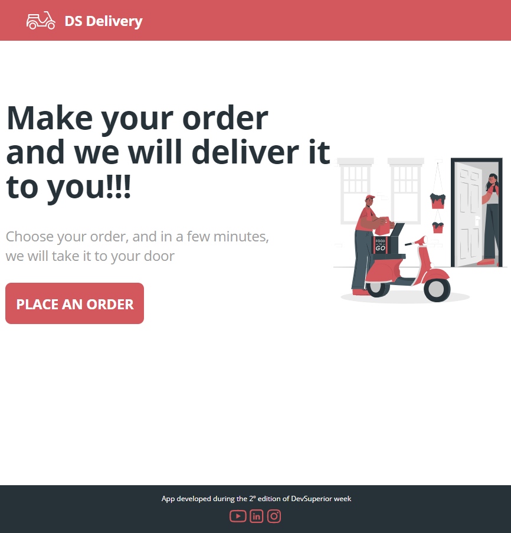
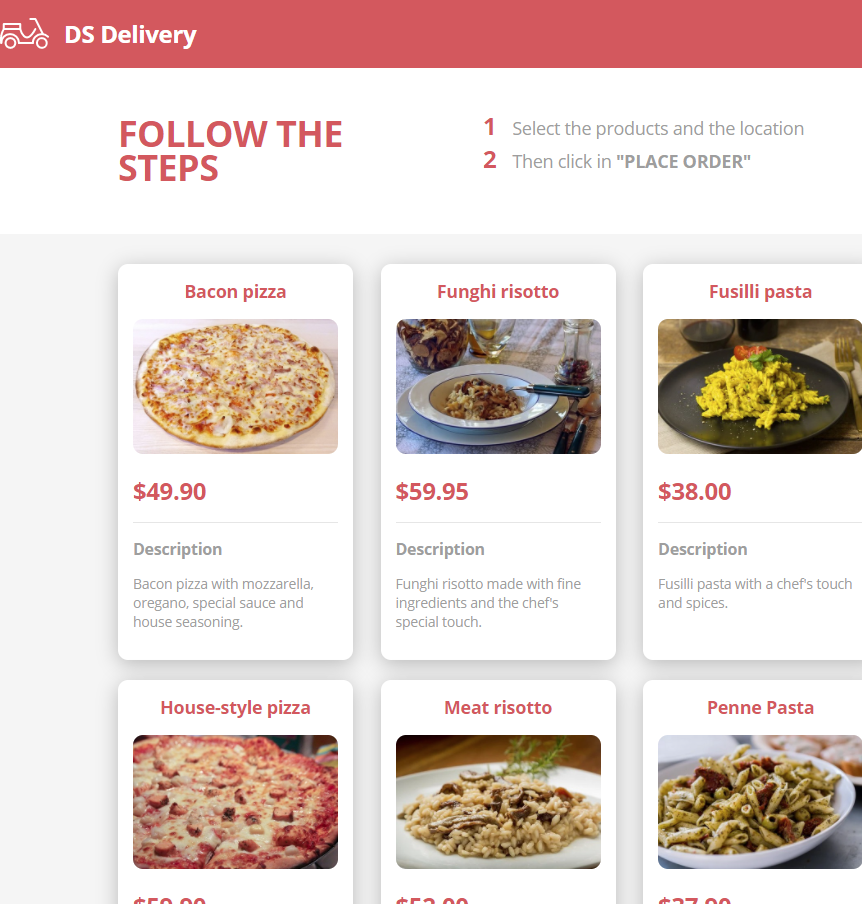
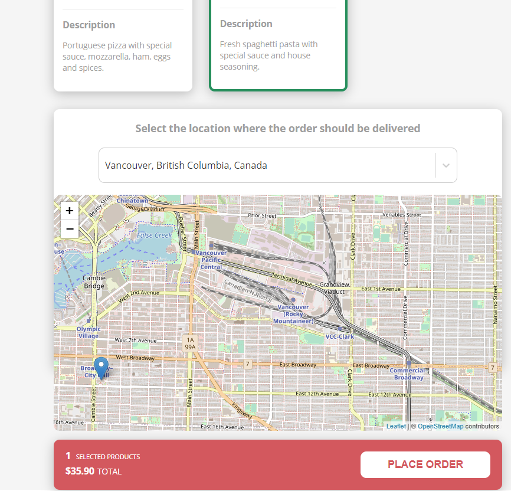
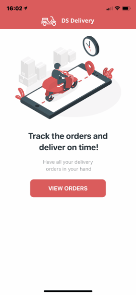
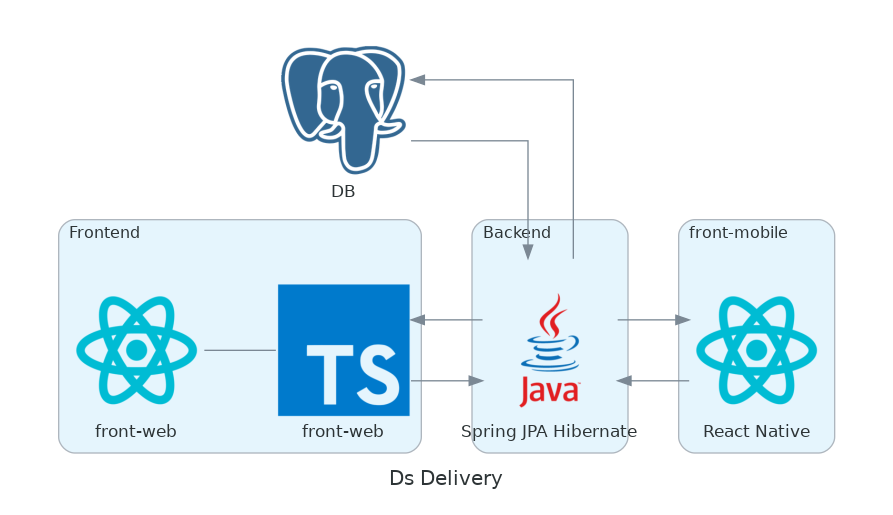
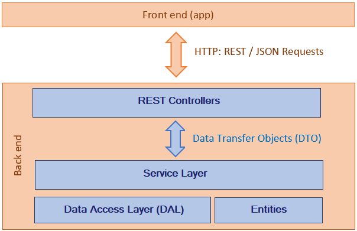

# Ds Delivery

[](https://github.com/opapito/dsdeliver-sds2/blob/main/LICENSE)

## About the project

The [DS Delivery project](https://sds2-opapito.netlify.app/ "DsDelivery") is a pizza delivery app composed of a front-end web application in React hosted on Netlify with a Spring Data Java Persistence API (JPA) with Hibernate Object-Relational Mapping (ORM) working as back-end serving data through a PostgreSQL database hosted on Heroku. The pizza delivery guy can access the orders made in the front-end through the front-end-mobile version written in React Native and then mark the delivered orders. The app was developed during dev superior week.

## Web layout







## Mobile layout



## Project Design



## Concept model


## Data access layer



## Technologies

### Backend

- Java
- Spring Boot
- JPA / Hibernate
- Maven

### Frontend

- HTML / CSS / JS / TypeScript
- ReactJS
- React Native
- Apex Charts
- Expo

### Deployment in production

- Back end: Heroku
- Front end web: Netlify
- Database: Postgresql

## Installing

### Backend

Prerequisites: Java 11

```bash
# The first step is to clone the project
git clone https://github.com/opapito/dsdeliver-sds2

# Enter the project directory
cd backend

# Run
./mvnw spring-boot:run
```

### Frontend web

Prerequisites: npm / yarn

```bash
# The first step is to clone the project
git clone https://github.com/devsuperior/sds1-wmazoni

# Enter the project directory
cd front-web

# Install dependencies
yarn install

# Run
yarn start
```
